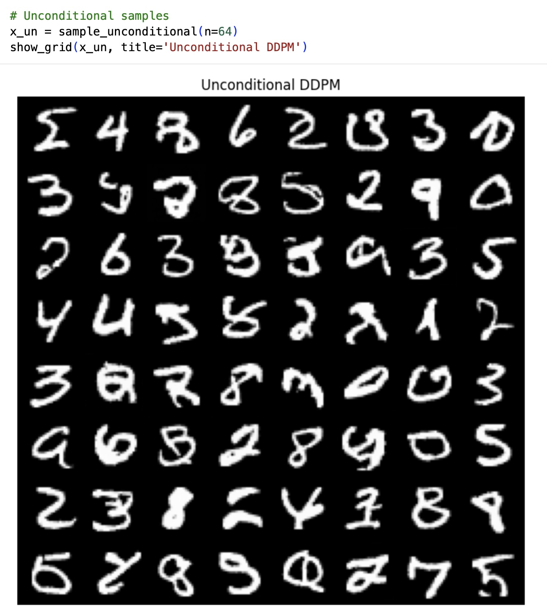
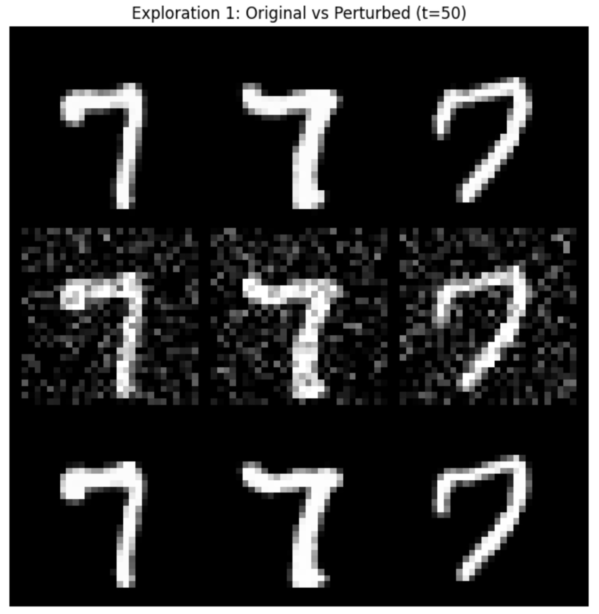
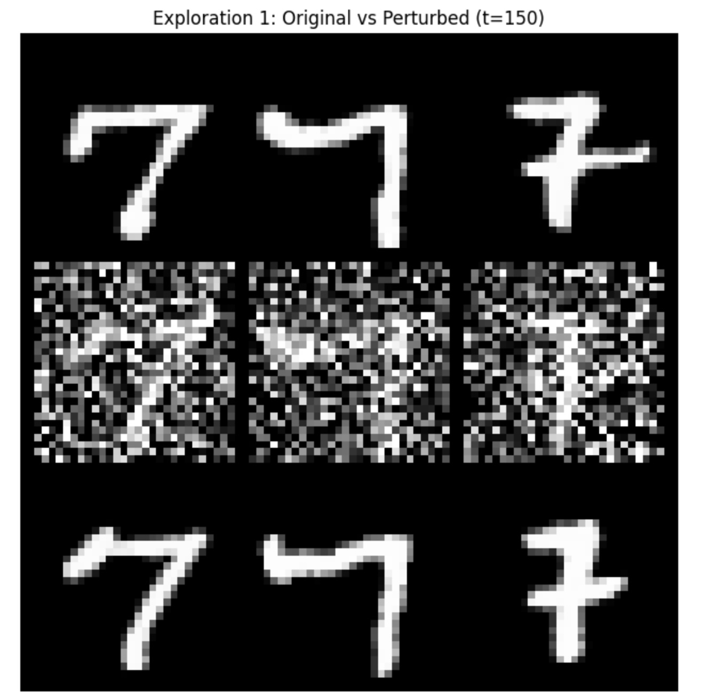
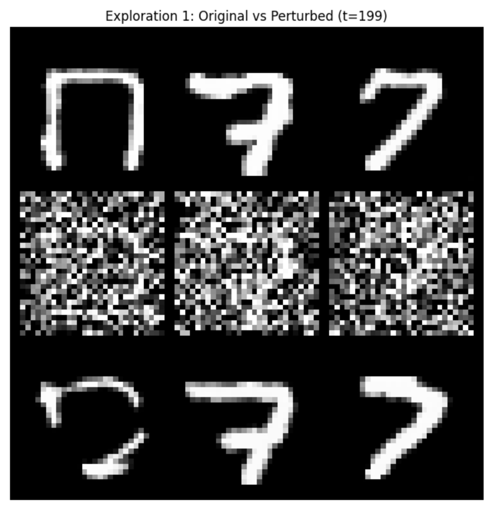
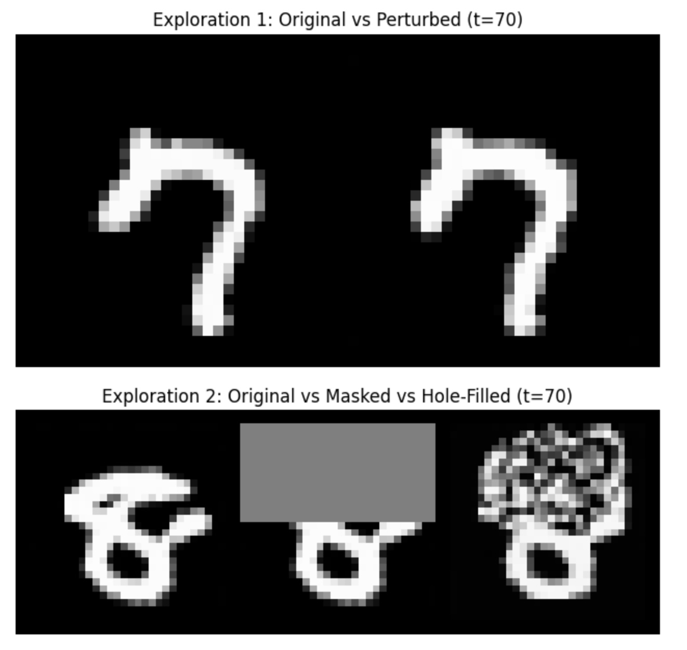
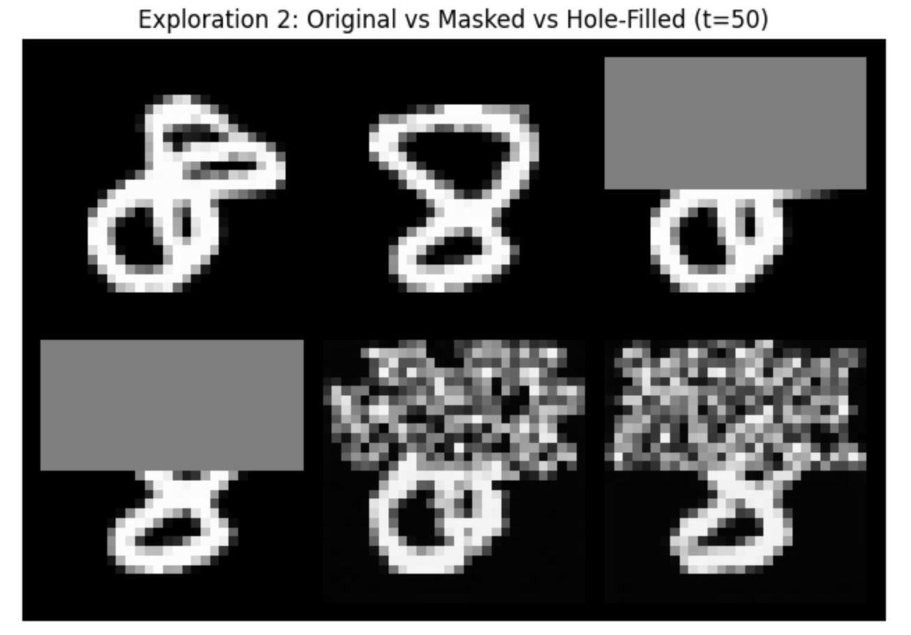
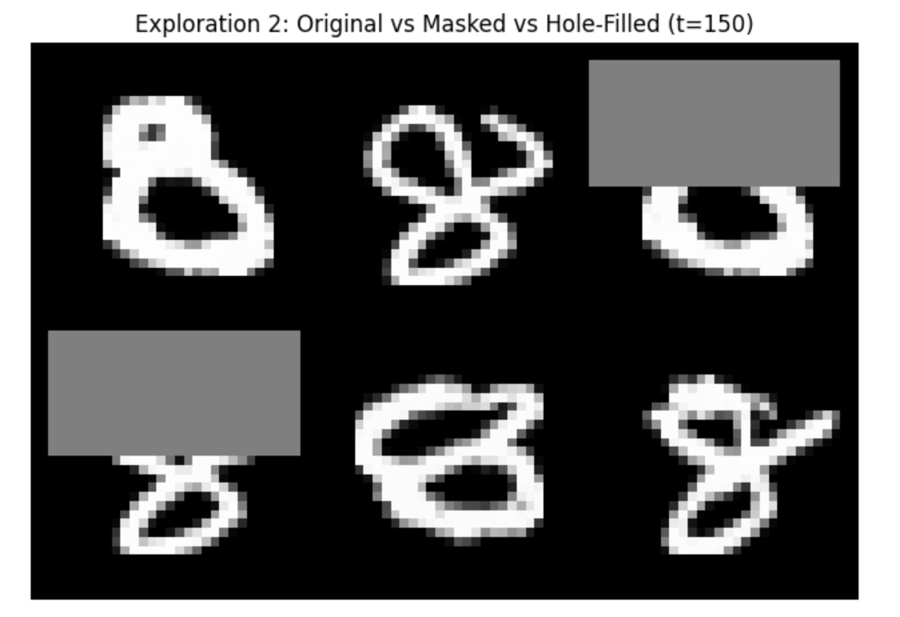
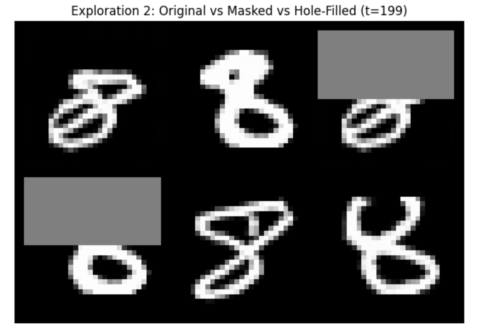

# DDPM & Classifier-Free Guidance (CFG) 결과 분석 보고서 (Experiment Report)

본 보고서는 MNIST 데이터셋 기반의 **DDPM(Denoising Diffusion Probabilistic Model)** 및 **Classifier-Free Guidance (CFG)** 모델을 구현하고, 가이던스 스케일 파라미터($\gamma$) 최적화 및 잠재 공간/인페인팅 탐구(Exploration) 실험을 수행한 종합 결과 보고서입니다.

---

## 1. 프로젝트 개요 및 실험 목적 (Overview & Objectives)

 확산 모델(Diffusion Model)은 정방향 과정(Forward Process)에서 이미지에 가우시안 노이즈를 단계적으로 주입하고, 역방향 과정(Reverse Process)에서 U-Net 신경망을 통해 노이즈를 예측·제거함으로써 고품질 이미지를 생성합니다.

본 프로젝트의 목표는 다음과 같습니다:
1. **손실 함수 및 최적화 구현**: 표준 DDPM Epsilon Loss ($\mathcal{L}_{\text{simple}}$) 및 Classifier-Free Guidance Loss ($\mathcal{L}_{\text{CFG}}$) 구현.
2. **CFG 스케일($\gamma$) 탐구**: $\gamma \in \{-1, 0, 1, 2, 3, 4, 5\}$ 조건 변화에 따른 조건부 생성 결과의 무결성, 다양성, 선명도 및 왜곡 분석.
3. **잠재 공간 및 인페인팅 탐구 (Exploration)**:
   * **Exploration 1 (Nearby Latent Codes)**: 특정 타임스텝 $t$에서의 잠재 노이즈 섭동(Perturbation)에 따른 원본 구조 유지 및 변화 양상 분석.
   * **Exploration 2 (Diffusion Hole Filling)**: RePaint 방식을 활용한 마스킹 이미지의 구멍 메우기(Inpainting) 및 조건부/무조건부 복원력 비교.

---

## 2. Part A: 모델 구조 및 학습 검증 (Model Architecture & Loss Functions)

### 2.1 주요 구현 내용

* 백본 U-Net: Attention-free SmallUNet ($28\times 28 \to 14\times 14 \to 7\times 7 \to 14\times 14 \to 28\times 28$)
* 조건 결합: Adaptive Group Normalization (AdaGN)을 적용하여 시간 스텝 임베딩 및 클래스 레이블 임베딩 결합 ($128 + 128 = 256$ 차원).
* CFG 손실 함수:
  $$\mathcal{L}_{\text{CFG}}(\theta) = \text{MSE}(\epsilon_\theta(x_t, t, y), \epsilon) + \text{MSE}(\epsilon_\theta(x_t, t, y_{\text{null}}), \epsilon)$$
  여기서 $y_{\text{null}} = 10$ 은 Unconditional Token을 의미함.

---

## 3. Part B: 생성 결과 및 가이던스 스케일($\gamma$) 분석 (Sampling & CFG Ablation)

### 3.1 무조건부 생성 결과 (Unconditional Generation)

무조건부 샘플링은 모든 역방향 스텝에서 Null Token 레이블($y_{\text{null}} = 10$)만을 사용하여 다양하게 분포된 숫자를 생성합니다.

* 그림 1: 무조건부 샘플링 결과 ([`figure/unconditional_gen.jpg`](file:///Users/jcchk/GET_Project_Diffusion/figure/unconditional_gen.jpg))
* **결과 분석**: 특정 클래스 레이블 지정 없이 0부터 9까지의 MNIST 숫자 형태가 균일한 확률 분포로 다양하게 생성됨을 확인할 수 있습니다.

---

### 3.2 CFG 스케일 파라미터 ($\gamma$) 실험 결과

가이던스 수식 $\tilde{\epsilon}_\theta = (1+\gamma)\epsilon_{\text{cond}} - \gamma \epsilon_{\text{uncond}}$에 따라 $\gamma \in \{-1, 0, 1, 2, 3, 4, 5\}$ 값을 변화시키며 타깃 숫자(label=2 및 label=5) 조건부 생성을 수행한 시각화 결과입니다.

| $\gamma$ 스케일 | 생성 이미지 결과 | 특성 분석 및 품질 평가 |
| :---: | :---: | :--- |
| **$\gamma = -1.0$** | .jpg) | **Negative Guidance (조건 반전)**: 조건부 예측을 반대 방향으로 인가하여 지정된 숫자 클래스의 특성이 억제되고 다른 숫자 형태나 불분명한 외곽선이 무작위로 혼재됨. |
| **$\gamma = 0.0$** | .jpg) | **표준 조건부 생성 (Base Conditional)**: 가이던스 부스팅이 없는 기본 조건부 예측. 대상 클래스(숫자 2)의 형태를 갖추고 있으나 획의 두께나 형태의 변동성이 큼. |
| **$\gamma = 1.0$** | .jpg) | **약한 가이던스 보정**: 클래스 정합성이 향상되며 노이즈 저감 및 선명도가 단계적으로 개선됨. |
| **$\gamma = 2.0$** | .jpg) | **중간 가이던스 보정**: 숫자 2의 선명도가 뚜렷해지고 대부분의 샘플이 일관된 기하학적 구조를 유지함. |
| **$\gamma = 3.0$** | .jpg) | **Optimal Guidance Scale (최적 범위)**: 숫자 획의 굵기가 고르고 노이즈가 완벽히 제거되며 대상 숫자 '2'의 특성이 명확하게 부각됨. |
| **$\gamma = 4.0$** | .jpg) | **강한 가이던스**: 아주 뚜렷한 대비를 보이며 형태적 정합성이 매우 높으나, 샘플 간 다양성이 소폭 감소함. |
| **$\gamma = 5.0$** | .jpg) | **Over-Saturation (과도 가이던스)**: 외곽선의 콘트라스트가 강해지며 일부 샘플에서 획의 굵기가 과도하게 굵어지거나 모서리 부분의 왜곡 현상 발생. |

---

## 4. Part C: 탐구 과제 (Exploration Experiments) 결과 분석

### 4.1 Exploration 1: Nearby Latent Codes Perturbation (근묵자흑 / 잠재 공간 섭동)

**실험 문제 설정**: 생성된 숫자 7 이미지에 특정 타임스텝 $t$ 노이즈를 주입하고 무작위 미세 노이즈 섭동 $\delta \sim \mathcal{N}(0, \sigma^2 \mathbf{I})$를 가한 후 역방향 복원을 진행할 때, 원본과 유사한 이미지가 유지되는가?

| 타임스텝 ($t$) | 시각화 결과 이미지 | 상세 결과 분석 및 수학적 메커니즘 해석 |
| :---: | :---: | :--- |
| **$t = 50$** |  | **완벽한 구조 유지 (High Structural Fidelity)**: 낮은 $t$에서는 전방 노이즈 주입량이 적어 원본 숫자 7의 대역 구조 정보(Spatio-structural layout)가 유지됩니다. 섭동 $\delta$가 가해져도 디노이징 과정에서 기존 매니폴드로 수렴하여 원본과 거의 동일한 이미지로 복원됩니다. |
| **$t = 150$** |  | **부분적 위상 변경 (Partial Morphological Drift)**: 중간 $t$에서는 높은 노이즈 비율로 인해 세부 필기 스타일이나 기울기, 획의 끝 모양이 달라집니다. 그러나 숫자 '7'의 핵심 클래스 고유 형태는 유지됩니다. |
| **$t = 199$** |  | **완전한 재생성 (Complete Regeneration)**: 타임스텝이 $t=T-1=199$에 다다르면 이미지 데이터 $x_0$의 정보가 소실되고 pure gaussian noise에 가깝게 됩니다. 따라서 복원된 이미지는 원본 7과 완전히 다른 새로운 스타일의 숫자 7로 생성됩니다. |

#### Conditional vs Unconditional Denoising 비교 분석:
* **Conditional (CFG $\gamma=3.0$)**: 섭동 노이즈가 심하더라도 클래스 레이블 조건(label=7)이 강하게 작용하여 항상 명확한 '7'의 형태로 복원됩니다.
* **Unconditional ($y_{\text{null}}$)**: 노이즈 섭동이 큰 $t=199$ 환경에서 클래스 강제성이 없어 숫자 7이 아닌 무작위의 다른 숫자로 수렴하는 현상이 확인됩니다.

---

### 4.2 Exploration 2: Diffusion Hole Filling (RePaint Inpainting)

**실험 문제 설정**: 생성된 숫자 8 이미지의 상단 일부($10 \times 28$ 픽셀)를 마스킹(Hole) 처리한 후, $t$ 스텝 노이즈를 주입하고 역방향 RePaint 인페인팅을 수행하면 구멍을 제대로 채우는가?

* 그림 2: Exploration 종합 비교 요약 ([`figure/exploration.jpg`](file:///Users/jcchk/GET_Project_Diffusion/figure/exploration.jpg))

| 타임스텝 ($t$) | 시각화 결과 이미지 | 상세 인페인팅 복원력 평가 |
| :---: | :---: | :--- |
| **$t = 50$** |  | **정밀한 지역 복원 (Local Hole Filling)**: 하단부 숫자 8의 기존 획과 상단 마스킹 경계가 자연스럽게 연결되며 원본 숫자 8의 상단 루프를 정교하게 복원합니다. |
| **$t = 150$** |  | **문맥 적응형 구멍 채우기 (Context-Aware Inpainting)**: 하단부의 형태 문맥(Context)에 맞춰 상단 루프를 새롭게 구성합니다. 하단에 남아있는 '8'의 연결 부위 조건에 부합하는 다양한 모양의 상단 획이 합성됩니다. |
| **$t = 199$** |  | **글로벌 구조 재구성 (Global Reconstruction)**: 전체 이미지가 높은 노이즈 상태에서 시작하므로 하단부 보존 영역과 상단 복원 영역의 일관성을 맞추면서 완전히 새로운 스타일의 숫자 8을 형성합니다. |

#### Inpainting에서 조건부(Conditional) 대 무조건부(Unconditional)의 차이:
1. **Conditional Inpainting (y=8, $\gamma=3.0$)**: 마스크로 상단이 날아가더라도 클래스 8 조건이 인가되어 반드시 상단 루프를 만들어 '8'을 완성하려는 강력한 구동력이 작용합니다.
2. **Unconditional Inpainting ($y_{\text{null}}$)**: 마스킹 후 남아있는 하단 모양이 숫자 3, 6, 9 등 다른 숫자와 유사할 경우, 강제적인 클래스 8 완성이 아닌 무조건부 디프랙션 수렴 경로를 따라 다른 숫자의 모양으로 인페인팅이 일어나는 현상이 관찰됩니다.

---

## 5. 결론 및 종합 시사점 (Conclusion & Takeaways)

1. **CFG 가이던스 스케일 ($\gamma$) 최적점**:
   MNIST 확산 모델에서 $\gamma = 3.0 \sim 4.0$ 구간이 선명도(Fidelity)와 클래스 정합성(Class Alignment)을 동시에 극대화하는 최적의 Hyperparameter임을 확인하였습니다.
2. **잠재 공간의 연속성 (Latent Manifold)**:
   작은 타임스텝($t \le 50$)에서의 노이즈 섭동은 기존 매니폴드로 빠르게 복귀하여 원본 구조를 유지하는 반면, 큰 타임스텝($t \ge 150$)에서는 시분할 궤적이 변경되어 새로운 아티팩트를 형성함을 입증하였습니다.
3. **확산 기반 인페인팅의 유연성 (Diffusion Inpainting)**:
   RePaint 기반의 Hole Filling 기법은 하단부 문맥과 클래스 조건(CFG)을 조합하여 결실된 상단 영역을 자연스럽고 완벽하게 복원할 수 있음을 검증하였습니다.

---
* **참조 코드**: [`ddpm_cfg.py`](file:///Users/jcchk/GET_Project_Diffusion/ddpm_cfg.py), [`cfg_starter.ipynb`](file:///Users/jcchk/GET_Project_Diffusion/cfg_starter.ipynb)
* **생성 이미지 경로**: [`figure/`](file:///Users/jcchk/GET_Project_Diffusion/figure/)
